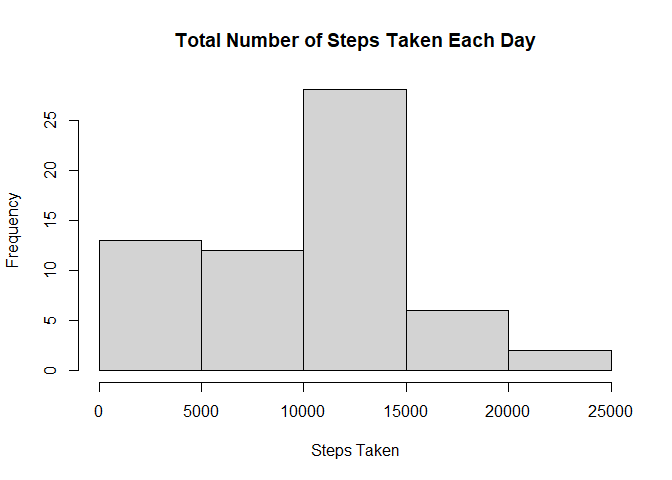
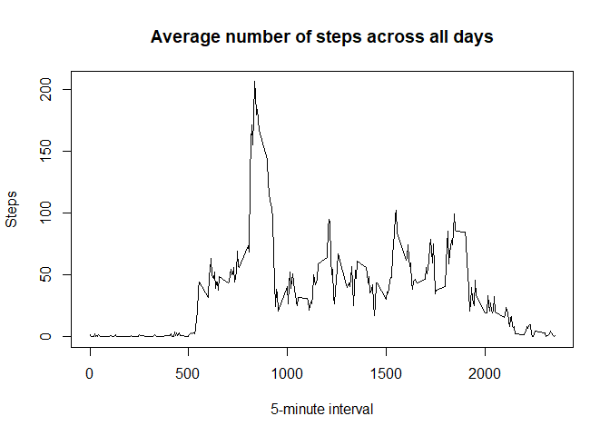
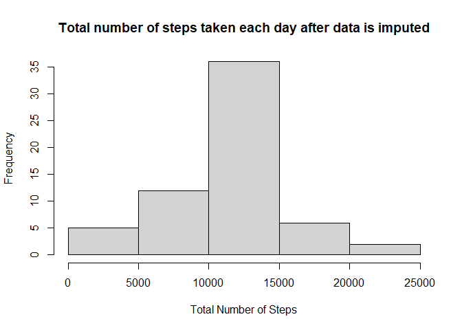

```r
knitr::opts_chunk$set(echo = TRUE)
knitr::opts_knit$set(root.dir = "C:/Users/James/Documents/JHU, R Coursera/RepData_PeerAssessment1")
options(scipen=999)
library(plyr)
library(dplyr)
```

```
## 
## Attaching package: 'dplyr'
```

```
## The following objects are masked from 'package:plyr':
## 
##     arrange, count, desc, failwith, id, mutate, rename, summarise,
##     summarize
```

```
## The following objects are masked from 'package:stats':
## 
##     filter, lag
```

```
## The following objects are masked from 'package:base':
## 
##     intersect, setdiff, setequal, union
```

```r
library(reshape2)
```

## Loading and preprocessing the data

The zip file of the data is already in the GitHub repo. Here, we unzip it to create a csv file:


```r
zipFile <- "activity.zip"
data <- "Data"
if (!file.exists(data)) {
  unzip(zipFile)
}

activity = read.csv("activity.csv", header=TRUE, sep=",", na.strings="NA")
head(activity)
```

```
##   steps       date interval
## 1    NA 2012-10-01        0
## 2    NA 2012-10-01        5
## 3    NA 2012-10-01       10
## 4    NA 2012-10-01       15
## 5    NA 2012-10-01       20
## 6    NA 2012-10-01       25
```

Only preprocessing we really need to do is transform the "date" column into an actual Date format:


```r
class(activity$date)
```

```
## [1] "character"
```

```r
activity$date = as.Date(activity$date, "%Y-%m-%d")
class(activity$date)
```

```
## [1] "Date"
```

## What is mean total number of steps taken per day?


```r
#calculate total number of steps each day
detach("package:plyr")
total_steps = group_by(activity, date) %>% summarise(total_steps = sum(steps, na.rm=T))
head(total_steps)
```

```
## # A tibble: 6 x 2
##   date       total_steps
##   <date>           <int>
## 1 2012-10-01           0
## 2 2012-10-02         126
## 3 2012-10-03       11352
## 4 2012-10-04       12116
## 5 2012-10-05       13294
## 6 2012-10-06       15420
```

Next, we will represent the above information in a histogram:


```r
hist(total_steps$total_steps, main="Total Number of Steps Taken Each Day", xlab="Steps Taken", ylab="Frequency")
```

<!-- -->

Here we calculate the mean and median of the total number of steps taken per day:


```r
mean_step = mean(total_steps$total_steps, na.rm=T)
median_step = median(total_steps$total_steps, na.rm=T)
```

The mean of the total number of steps taken per day is __9354.2295082__.
The median of the total number of steps taken per day is __10395__.

## What is the average daily activity pattern?

To visualise this, we will make a time series plot of the 5-minute interval (x-axis) and the average number of steps taken, averaged across all days (y-axis)


```r
#find the average no. of steps taken with regard to interval
avg_steps = group_by(activity, interval) %>% summarise(steps = mean(steps, na.rm=T))
head(avg_steps)
```

```
## # A tibble: 6 x 2
##   interval  steps
##      <int>  <dbl>
## 1        0 1.72  
## 2        5 0.340 
## 3       10 0.132 
## 4       15 0.151 
## 5       20 0.0755
## 6       25 2.09
```

```r
#make a time series plot
plot(avg_steps$interval, avg_steps$steps, type = "l", xlab="5-minute interval", ylab="Steps", main="Average number of steps across all days")
```

<!-- -->

Now, we find which 5-minute interval, on average across all days in the dataset, contains the maximum number of steps?


```r
max_index = which.max(avg_steps$steps)
max_interval = avg_steps[max_index, 'interval']
max_avg_step = avg_steps[max_index, 'steps']
```

Thus, the __835__ 5-minute interval contains the maximum number of steps, __206.1698113__ steps.

## Imputing missing values

There are a number of days/intervals where there are missing values coded as NA. The presence of missing days may introduce bias into some calculations or summaries of the data. We will first find the total number of missing values in the dataset.


```r
#calculate total number of rows with NAs
missing = sum(is.na(activity$steps))
```

The total number of missing values in the dataset is __2304__

For filling in the missing values, we will use the mean for that 5-minute interval.


```r
#create copy of dataset and
#impute missing values to dataset copy
library(plyr)
```

```
## ------------------------------------------------------------------------------
```

```
## You have loaded plyr after dplyr - this is likely to cause problems.
## If you need functions from both plyr and dplyr, please load plyr first, then dplyr:
## library(plyr); library(dplyr)
```

```
## ------------------------------------------------------------------------------
```

```
## 
## Attaching package: 'plyr'
```

```
## The following objects are masked from 'package:dplyr':
## 
##     arrange, count, desc, failwith, id, mutate, rename, summarise,
##     summarize
```

```r
dataMelt <- melt(activity, id = c("date", "interval"), measure.vars = "steps")
complete_activity <- ddply(dataMelt, "interval", function(x){       
        x$value[is.na(x$value)] <- mean(x$value, na.rm=TRUE)
        return(x)
        })
complete_activity <- dcast(complete_activity, date + interval ~ variable)
head(complete_activity)
```

```
##         date interval     steps
## 1 2012-10-01        0 1.7169811
## 2 2012-10-01        5 0.3396226
## 3 2012-10-01       10 0.1320755
## 4 2012-10-01       15 0.1509434
## 5 2012-10-01       20 0.0754717
## 6 2012-10-01       25 2.0943396
```

```r
still_missing = sum(is.na(complete_activity$steps))
```

There are now __0__ NAs.

In order to compare the original dataset with the dataset with imputed values, we will calculate the same statistics for the new dataset.


```r
#create a histogram of the total number of steps taken each day
detach("package:plyr")
total_steps_imputed = group_by(complete_activity, date) %>% summarise(steps_imputed = sum(steps))
head(total_steps_imputed)
```

```
## # A tibble: 6 x 2
##   date       steps_imputed
##   <date>             <dbl>
## 1 2012-10-01        10766.
## 2 2012-10-02          126 
## 3 2012-10-03        11352 
## 4 2012-10-04        12116 
## 5 2012-10-05        13294 
## 6 2012-10-06        15420
```

```r
#plot histogram
hist(total_steps_imputed$steps_imputed, main = "Total number of steps taken each day after data is imputed", xlab = "Total Number of Steps")
```

<!-- -->

```r
#calculate mean and median of the total number of steps taken each day for the dataset with imputed values
mean_imputed = mean(total_steps_imputed$steps_imputed)
median_imputed = median(total_steps_imputed$steps_imputed)
```

The mean of the total number of steps taken per day is __10766.1886792__
The median of the total number of steps taken per day is __10766.1886792__  

The mean of the imputed dataset compared to the original dataset is quite different (~1400 steps greater), likely due to the method of imputation.
The median of the imputed dataset compared to the original dataset is different, but to a lesser degree (~350 steps greater).    

As for the estimated total number of steps, both datasets show that most days fall between 10,000 and 15,000 steps. For the dataset with imputed data, more of the days fall in this range (10 more days than the original dataset). This is likely due to the way data was imputed.  

## Are there differences in activity patterns between weekdays and weekends?

First, we will create a new factor variable with 2 levels - "weekday" and "weekend" to classify the days.


```r
complete_activity['day_type'] = factor(sapply(complete_activity$date, function(x) {if (weekdays(x) == "Saturday" | weekdays(x) == "Sunday") {"weekend"} else {"weekday"} }))
```

Next, we will create a panel plot of the 5-minute interval and the average number of steps taken, averaged across all weekday days or weekend days.


```r
#find average steps across all days
avg_steps_type = group_by(complete_activity, day_type, interval) %>% summarise(avgsteps = mean(steps))
head(avg_steps_type)
```

```
## # A tibble: 6 x 3
## # Groups:   day_type [1]
##   day_type interval avgsteps
##   <fct>       <int>    <dbl>
## 1 weekday         0   2.25  
## 2 weekday         5   0.445 
## 3 weekday        10   0.173 
## 4 weekday        15   0.198 
## 5 weekday        20   0.0990
## 6 weekday        25   1.59
```

```r
#create plot
library(lattice)
xyplot(avgsteps~interval | day_type, data = avg_steps_type, type = "l", layout = c(1, 2), xlab = "Interval", ylab = "Number of Steps")
```

<!-- -->

